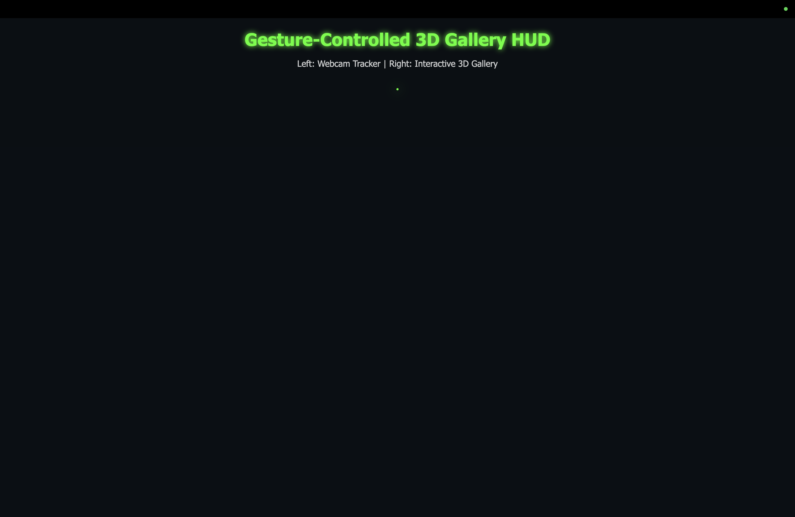

# Gesture-Controlled 3D Gallery HUD (AI Vision Interface)



This project is a futuristic, gesture-controlled 3D image gallery using your webcam and hand tracking. It uses OpenCV, MediaPipe, and NumPy to let you rotate and zoom a floating 3D gallery of images with your hand gestures, all in real time.

## Features
- Control a 3D image gallery with your hand (pinch to zoom, move to rotate)
- Futuristic HUD overlay with neon accents
- Real-time hand tracking and smooth interaction
- Images loaded from a local `gallery/` folder

## How to Run
1. Clone this repository.
2. Place your images (`.jpg`/`.png`) in a folder named `gallery` in the project root.
3. Install dependencies:
   ```bash
   pip install opencv-python mediapipe==0.10.14 numpy flask
   ```
4. Run the desktop version:
   ```bash
   python main.py
   ```
5. Or run the web server version:
   ```bash
   python server.py
   ```

---
Enjoy exploring your images in a whole new way!
